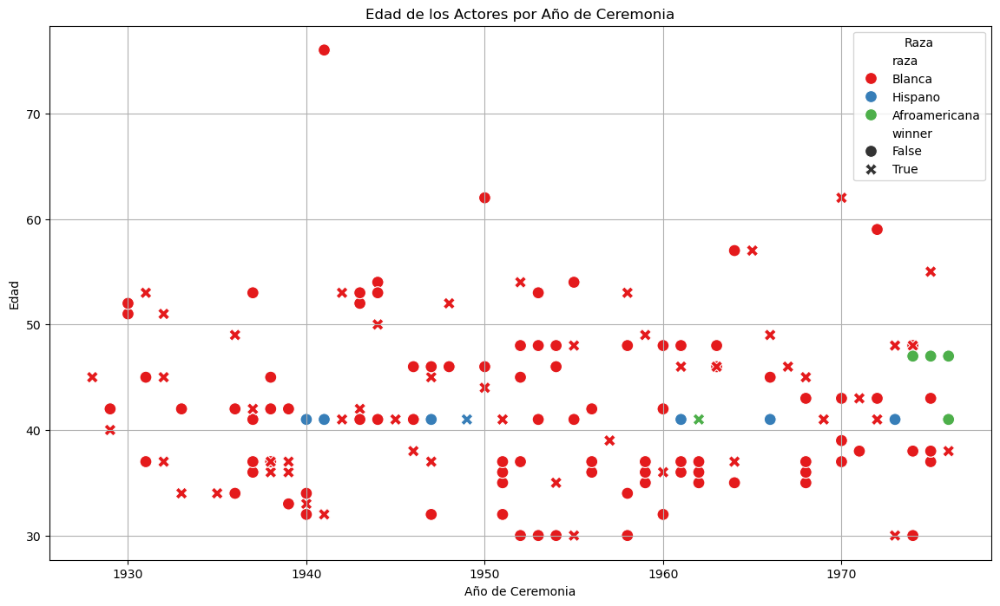

# 🎬 Cinematic Data Analysis Project

Collaborative project of the third week of the Ironhack bootcamp.

## 🎯 Objective

This project is aimed at creating a guide for actors awarded the Oscar. We will rely on a combination of different types of data (CSV, our own dataframes, and web scraping) to analyze the factors that may influence winning an Oscar. The analyses will focus on:

- 🌍 Nationality
- 🏳️ Race
- 🎂 Age
- 🎥 Director of the most awarded movies
- 💰 Movie budget
- 🎟️ Box office percentage

With these conclusions, we can offer a guide for future actors, providing them with guidelines based on the analysis from the first gala year in 1928 to the last in 2024.

## 📊 General Analysis

For this project, we have used different types of data: CSV, EXCEL, and Web-Scraping. The data files include:

- `data/oscars3.csv`
- `data/actor_año_presupuesto_taquilla.ods`
- `data/imdb_movies_budgets.csv`
- `data/imdb_top1000_highest_grossing.csv`

## 🏆 Key Results

### 🥇 Top 10 Actors with Most Awards

### 📈 Profitability History

### 💸 Profitability: Box Office/Budget Ratio

### 👶👴 Age Distribution of Actors

### 🧑🏽‍🤝‍🧑🏿 Historical Actors by Race and Age

### 📊 Ethnicity Percentages

### 🌎 Nationality of Actors

