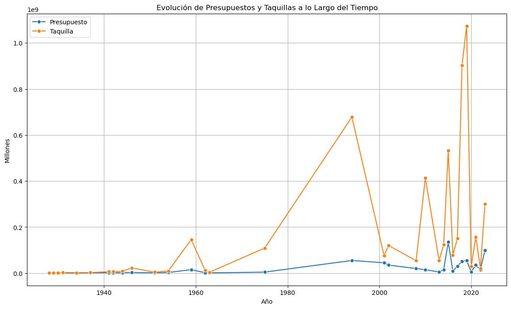

# Proyecto de análisis de datos cinematográficos

Proyecto colaborativo de la tercera semana del bootcamp de Ironhack.

## Objetivo

Este proyecto está orientado a la creación de una guía para actores galardonados con el premio Oscar. Nos basaremos en una combinación de datos de distintos tipos (CSV, dataframes propios y web scraping) para analizar los factores que pueden influir en la obtención de un Oscar. Los análisis se centrarán en:

- Nacionalidad
- Raza
- Edad
- Director de las películas más galardonadas
- Presupuesto de la película
- Porcentaje de taquilla

Con estas conclusiones, podemos ofrecer una guía para futuros actores, brindándoles directrices basadas en el análisis desde el primer año de gala en 1928 hasta el último en 2024.

## Análisis Generales

Para la realización de este proyecto, hemos utilizado datos de distintos tipos: CSV, EXCEL y Web-Scraping. Los archivos de datos incluyen:

- `data/oscars3.csv`
- `data/actor_año_presupuesto_taquilla.ods`
- `data/imdb_movies_budgets.csv`
- `data/imdb_top1000_highest_grossing.csv`

## Resultados Clave

### Top 10 Actores con Más Premios

### Histórico de Rentabilidad

### Relación entre Taquilla y Presupuesto

### Distribución de Edades de los Actores

### Porcentajes de Etnia

### Nacionalidad de los Actores

